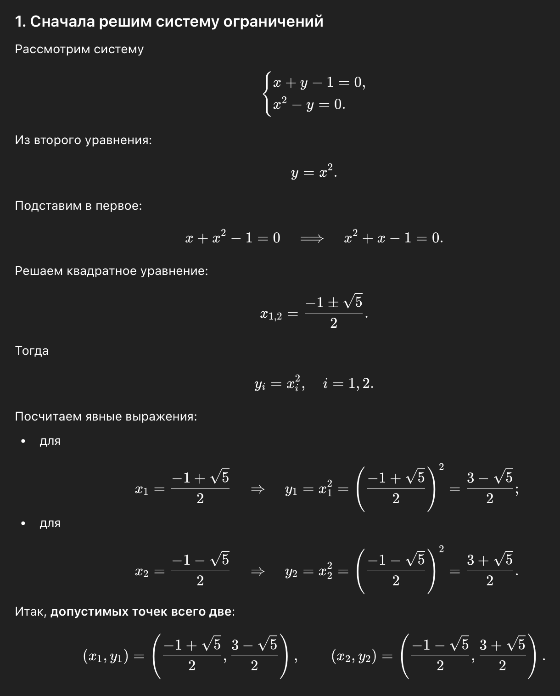
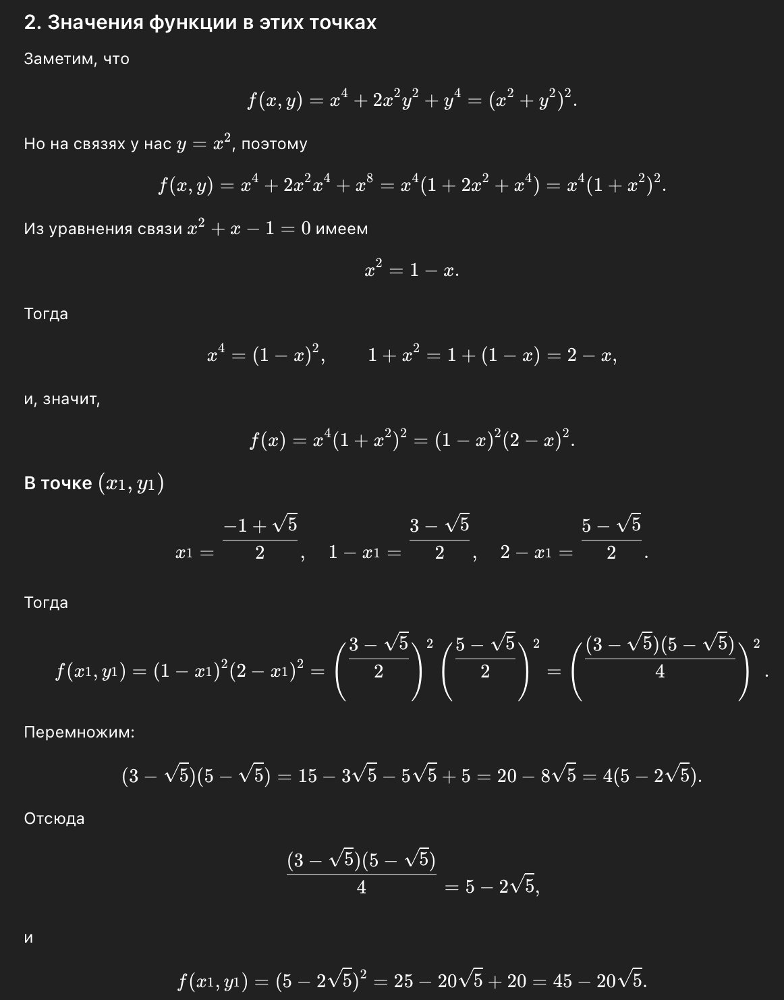
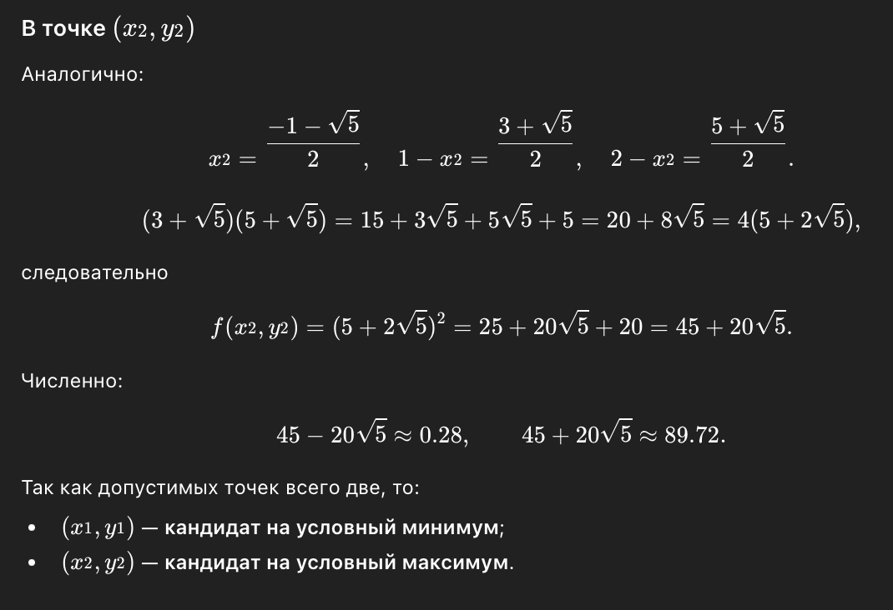
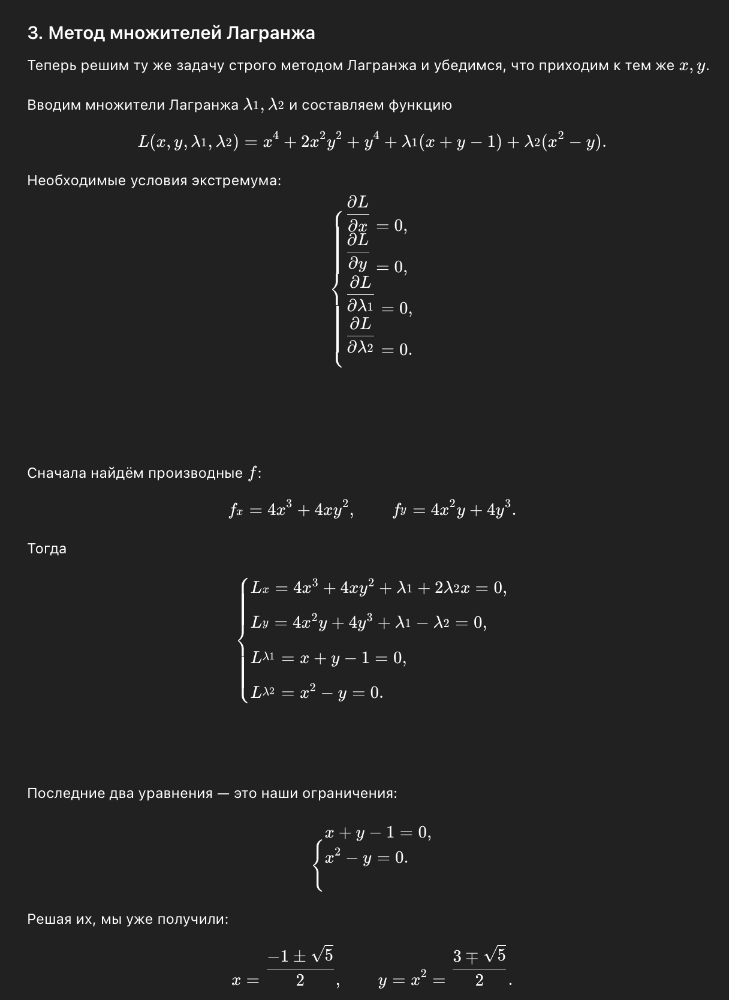
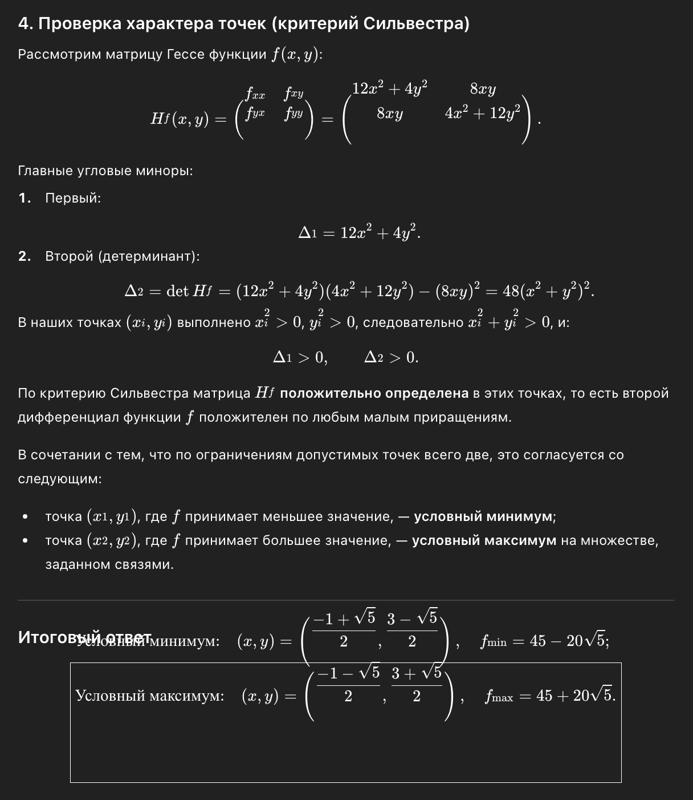

# Задание №3. Решение задачи условной выпуклой оптимизации с помощью метода множителей Лагранжа

## Ф.И.О.

Федоров Даниил Михайлович

## Группа

K3340

## Поток

МЕТОПТ 1.1

Номер моей позиции в списке потока 49, следовательно мой вариант - 9.

Минимизировать $f(x,y)=x^4+2x^2y^2+y^4$ при

$$
g_1(x,y)=x+y-1=0,\quad g_2(x,y)=x^2-y=0.
$$

## Решение БЯМ

## 1.Анализ решения системы ограничений 

Решена система уравнений ограничений, найдены все допустимые точки.
Решение верное. В задаче с двумя ограничениями в ℝ² допустимое множество состоит из изолированных точек. Получены две точки:

$$
P_1 = \left( \frac{-1+\sqrt{5}}{2}, \frac{3-\sqrt{5}}{2} \right),
\quad
P_2 = \left( \frac{-1-\sqrt{5}}{2}, \frac{3+\sqrt{5}}{2} \right)
$$

## 2.Анализ вычисления значений функции 

1. БЯМ заметил, что $f(x,y) = (x^2 + y^2)^2$
2. Использовал связь $y = x^2$ из ограничений
3. Получил упрощённое выражение $f(x) = (1-x)^2(2-x)^2$
4. Вычислил значения:

$$
f(P_1) = 45 - 20\sqrt{5} \approx 0.279,
\quad
f(P_2) = 45 + 20\sqrt{5} \approx 89.721
$$

Все преобразования алгебраически корректны. Поскольку допустимых точек всего две, меньшая даёт минимум, большая — максимум.

## 3.Анализ применения метода множителей Лагранжа

### Что сделал БЯМ
1. Ввел функцию Лагранжа:

$$
L(x,y,\lambda_1,\lambda_2) = f(x,y) + \lambda_1 g_1(x,y) + \lambda_2 g_2(x,y)
$$
   
2. Записал необходимые условия:

$$
\begin{cases}
\frac{\partial L}{\partial x} = 4x^3 + 4xy^2 + \lambda_1 + 2\lambda_2 x = 0 \\
\frac{\partial L}{\partial y} = 4x^2y + 4y^3 + \lambda_1 - \lambda_2 = 0 \\
\frac{\partial L}{\partial \lambda_1} = x + y - 1 = 0 \\
\frac{\partial L}{\partial \lambda_2} = x^2 - y = 0
\end{cases}
$$

3. Отметил, что два последних уравнения - это исходные ограничения

Все уравнения записаны правильно. БЯМ не стал находить конкретные значения $\lambda_1, \lambda_2$, что допустимо, так как для определения точек-кандидатов достаточно решить систему ограничений. Какая точка является минимумом, а какая максимумом можно установить простым сравнением значений $f$ .

## 4.Анализ применения Критерия Сильвестра

В решении БЯМ использовал **критерий Сильвестра** для матрицы Гессе целевой функции \( f(x, y) \). 
При наличии ограничений размерность **касательного пространства** (пространства допустимых направлений) может быть меньше, чем размерность исходного пространства. В этой задаче, где количество ограничений равно размерности пространства (два ограничения для двух переменных), касательное пространство имеет **размерность 0**, и потому нельзя применить критерий Сильвестра на Гессиане целевой функции \( f(x, y) \).

Поскольку множество допустимых точек состоит всего из двух точек, достаточно было **сравнить значения функции** на этих точках, чтобы понять, где достигается минимум, а где — максимум:
- **Условный минимум** находится в точке \( (x_1, y_1) \), где функция принимает минимальное значение.
- **Условный максимум** находится в точке \( (x_2, y_2) \), где функция принимает максимальное значение.

## Рефлективное заключение

В рамках данной работы, я попрактиковался использовать БЯМ в нахождении минимума функции с помощью метода множителей Лагранжа. Это был полезный опыт, который показывает, что БЯМ может решить верно задачу, но ей тяжело отклониться от промпта, даже если какая-то его часть избыточна для решения.

