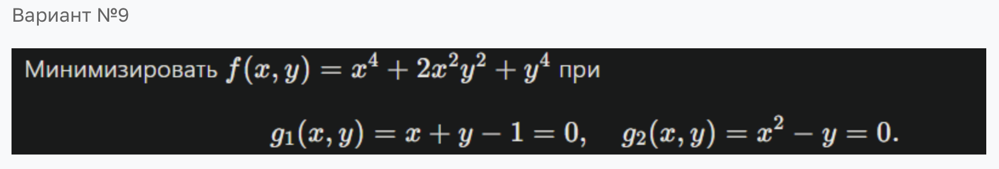

# Задание №3. Решение задачи условной выпуклой оптимизации с помощью метода множителей Лагранжа

## Ф.И.О.

Федоров Даниил Михайлович

## Группа

K3340

## Поток

МЕТОПТ 1.1

Номер моей позиции в списке потока 49, следовательно мой вариант - 9.

Минимизировать $f(x,y)=x^4+2x^2y^2+y^4$ при

$$
g_1(x,y)=x+y-1=0,\quad g_2(x,y)=x^2-y=0.
$$

